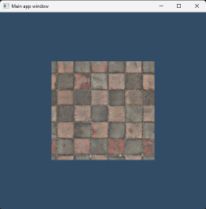

 
Based in Bristol, United Kingdom  

<h2>Socials</h2>
<a href="https://github.com/samuelbadman"><b>GitHub</b></a> |
<a href="https://artstation.com/samuelbadman"><b>ArtStation</b></a> |
<a href="https://youtube.com/@samuel_badman"><b>YouTube</b></a> |
<a href="https://linkedin.com/in/samuelbadmandev"><b>Linkedin</b></a> |
<a href="https://samuelbadman.com"><b>Portfolio</b></a> 
 
<a href="mailto: samuelbadman@outlook.com">Contact email: <b>samuelbadman@outlook.com</b></a> 
  

<h2>Portfolio</h2>

<h3>Leviathan Engine</h3>
 
Leviathan Engine is in development 3D game engine tools used to build and run games. <a href="https://github.com/samuelbadman/leviathan"><b>Source code</b></a> and <a href="https://www.youtube.com/playlist?list=PLZsLoVvciF_EJU5ueWZNFb4inzbK4gmgn"><b>development video playlist</b></a>.
  

<h3>Real time IK foot placement</h3>
 
Foot placement system for characters using real time IK solving. Implemented in Unreal Engine 5 with C++. <a href="https://github.com/samuelbadman/IKFootPlacement"><b>Source code</b></a> and <a href="https://www.youtube.com/watch?v=117fFG6Wtn0"><b>demo video</b></a>.
  

<h3>Custom kinematic pawn controller</h3>
 
Custom kinematic pawn controller component that implements locomotion mechanics for a third person character. Implemented in Unreal Engine 5 with C++. <a href="https://github.com/samuelbadman/CustomKinematicPawnController"><b>Source code</b></a> and <a href="https://www.youtube.com/watch?v=7_GY_lDoqdk"><b>demo video</b></a>.
  

<h3>Game technology programming reel</h3>
 
<a href="https://www.youtube.com/watch?v=ihn_z0QNYa4"><b>Highlight reel</b></a> showing some of my undergraduate work.
  

<h3>Retro inspired FPS rendered with Vulkan</h3>
 
Retro inspired first person shooter game created for the Windows platform and rendered with Vulkan. <a href="https://github.com/samuelbadman/Retro_fps_vulkan/tree/main"><b>Source code</b></a> and <a href="https://www.youtube.com/watch?v=3NXgvVLPRhQ"><b>demo video</b></a>.
  

<h3>Direct3D 12/DirectX Raytracing real-time GPU raytraced hard shadows</h3>
 
Hard shadows rendered in real-time using the GPU to raytrace scene geometry. Runs on Windows platform and uses Direct3D 12 and DirectX Raytracing APIs. <a href="https://github.com/samuelbadman/DXR_raytraced_hard_shadows"><b>Source code</b></a> and <a href="https://www.youtube.com/watch?v=RjFkShubgc8"><b>demo video</b></a>.
  

<h3>Competition game</h3>
 
Created for the <a href="https://gradsingames.com/game-dev-challenges/search-for-a-star/"><b>Search For a Star competition</b></a> with Unreal Engine 4 utilising Blueprint visual scripting and C++. The project was awarded the one to watch award. <a href="https://www.youtube.com/watch?v=N8DjZlzChRs"><b>Gameplay video</b></a>. Download and play from <a href="https://samuelbadman.itch.io/spy-league-training"><b>Itch</b></a>. Unreal project and source code files are available <a href="https://github.com/samuelbadman/CompetitionGame"><b>here</b></a>.
  

<h3>Online multiplayer game</h3>
 
University project created by a team of around 30 people in the Unity engine with C# for PC. I was part of the sub-team responsible for implementing online networked gameplay code. The game is an online multiplayer game featuring first person shooter gameplay that sees two teams challenge each other for control of key areas of the island. Players are able to transform into a jet aircraft to quickly reach areas of the island and command AI units. <a href="https://www.youtube.com/watch?v=I0o2VRTXH3c"><b>Gameplay trailer video</b></a>.
  

<h3>Real-time 3D game character asset</h3>
 
Character model and skeleton asset created for and rendered in Unreal Engine 5. <a href="https://www.artstation.com/artwork/lDogqG"><b>Artstation page</b></a> and a <a href="https://samuelbadman.artstation.com/pages/making-of-fallen-warrior"><b>making of</b></a> process breakdown is available at the links.
  

<h3>Mannequin animation rig asset</h3>
 
Mannequin animation rig asset created to be used for prototyping gameplay animation and technical animation implementations inside a game engine. <a href="https://www.artstation.com/artwork/AZK2Ey"><b>Artstation page</b></a> and a <a href="https://samuelbadman.artstation.com/pages/making-of-mannequin-animation-rig"><b>making of</b></a> process breakdown is available at the links.
  

<h3>Horror scene lighting</h3>
 
I took a ready made scene from the marketplace and removed all lighting from it. I then recreated lighting for the scene and added first person gameplay and audio effects aiming for a horror mood inspired by the Resident Evil video game series. The scene is rendered and lit in Unreal Engine 5 using dynamic lights and Lumen global illumination. <a href="https://www.artstation.com/artwork/EzGYE0"><b>Artstation page</b></a> and <a href="https://www.youtube.com/watch?v=XWYu0-a3uN0"><b>video playthrough</b></a>.

